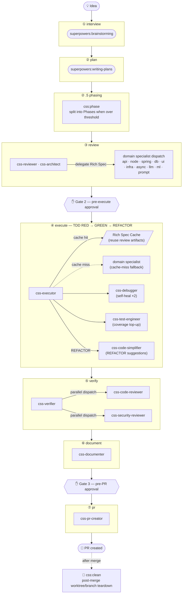

> **English** · [한국어](README.md)

# css-claude

**CSS — Claude Super System**: a personal, global software-development automation pipeline for [Claude Code](https://claude.com/claude-code).

Status: **v0.2.0**. Personal-use pipeline. See [`docs/installation.md`](docs/installation.md) for setup.

---

## Overview

Give it an idea and it runs all the way through: spec → plan → review → TDD implementation → verify → document → PR, with post-merge cleanup handled by `/css:clean`. Twenty-two specialized agents are dispatched stage by stage, with human approval gates at the high-stakes decision points.

```
/css:interview  →  /css:plan  →  /css:phase  →  /css:review  →  /css:execute  →  /css:verify  →  /css:document  →  /css:pr
                                                                                                                        ↑
                                                         /css:ship  ──── runs the whole pipeline with 3 approval gates ─┘
                                                                                    (post-merge cleanup: /css:clean)
```

### Pipeline + agent topology



### Stage-by-stage detail

| Stage | Command | Agents | Output |
|:---:|--------|----------|--------|
| ① | `/css:interview` | `superpowers:brainstorming` | `docs/superpowers/specs/YYYY-MM-DD-*.md` |
| ② | `/css:plan` | `superpowers:writing-plans` | `docs/superpowers/plans/YYYY-MM-DD-*.md` |
| ②.5 | `/css:phase` | (executor) | `phase-manifest-{slug}.json` + child Phase sessions |
| ③ | `/css:review` | `css-reviewer` (opus) + domain specialists | Rich Spec (per-task RED scaffold + GREEN template) |
| ④ | `/css:execute` | `css-executor` (sonnet) + fallback specialists | `css/{slug}` branch — TDD implementation complete |
| ⑤ | `/css:verify` | `css-verifier` + `css-code-reviewer` + `css-security-reviewer` | verification report (coverage ≥85%) |
| ⑥ | `/css:document` | `css-documenter` (sonnet) | `docs/{slug}/README.md` and more (Phase sessions: `docs/{epic}/p{n}/README.md`) |
| ⑦ | `/css:pr` | `css-pr-creator` (haiku) | GitHub PR (Phase sessions: `--base <base_branch>` stacked PR) |
| post | `/css:clean` | — | worktree/local-branch teardown after the PR merges (never deletes unmerged or unpushed work without confirmation) |
| aux | `/css:wiki` | `css-doc-curator` (sonnet) | Curates `docs/project/` living docs (feature SoT, architecture, schema, ops, ADRs) + read-only GitHub Wiki mirror (`--init` bootstrap, `--no-publish` to skip the mirror) |

### Domain-specialist agents (11 of 22)

They author Rich Specs in the review stage and are only called as a fallback on a cache miss during execute (~40–50% cost savings).

| Agent | Specialty | Model |
|----------|-----------|:----:|
| `css-api-specialist` | Python / FastAPI REST·GraphQL API design | sonnet |
| `css-node-backend` | Node.js / NestJS (3-layer + DI) backend | sonnet |
| `css-spring-backend` | Java·Kotlin / Spring Boot (3-layer + DI) backend | sonnet |
| `css-db-specialist` | PostgreSQL / Redis / ARQ + MongoDB + JPA·QueryDSL + TypeORM·Mongoose (polyglot data) | sonnet |
| `css-ui-engineer` | Web (React/Vue/Svelte/Angular + Next.js) + Android (Compose) UI | sonnet |
| `css-infra-engineer` | Docker / Kubernetes / CI-CD / nginx + Terraform | sonnet |
| `css-async-coder` | Python asyncio concurrency | sonnet |
| `css-langgraph-engineer` | LangChain / LangGraph / LangFuse + vector DB / RAG | sonnet |
| `css-ml-engineer` | scikit-learn / PyTorch features·inference·eval (testable code) | sonnet |
| `css-prompt-engineer` | 9-section prompt design and refactoring | opus |
| `css-architect` | architecture advisory (read-only, review-stage advisory) | opus |

### Epic / Phase decomposition

Large ideas are hard to handle in a single execution session. CSS plans an idea as an **Epic** and then decomposes it into **Phases** that can run in parallel or in sequence.

| Layer | Description |
|------|------|
| **Project** | a single software project (`css-claude`, `web-project`, etc.) |
| **Epic** | the full plan covering one feature scope (per slug, a single `_active.json` entry) |
| **Phase** | an independently executable unit carved out of the Epic as a vertical slice — each gets its own worktree + branch + PR |
| **Stage** | a pipeline stage within each Phase (plan/review/execute/verify/document/pr) |

**Threshold (D7):** if `task_count > 20 OR batch_count > 4`, `/css:phase` decomposes the Epic into 2–5 Phases. Below the threshold it proceeds as a single session (existing behavior preserved).

**Branch rules:** `phase_slug = "{epic}-p{n}"`, `phase_branch = "css/{epic}/p{n}"`. A Phase with predecessors creates a stacked PR based on the predecessor Phase's branch.

Detailed design: [`docs/superpowers/specs/2026-05-29-epic-phase-pipeline-design.md`](docs/superpowers/specs/2026-05-29-epic-phase-pipeline-design.md)

---

## Quick start

After installing, both environments run the **same pipeline**. Claude Code uses `/css:*` commands; Codex App and CLI use installed `css-*` skills.

### Claude Code

Full pipeline (driven through all 3 approval gates):

```
/css:ship "<idea>"
```

Or run it stage by stage:

```
/css:interview → /css:plan → /css:phase → /css:review → /css:execute → /css:verify → /css:document → /css:pr
(after the PR merges) /css:clean
```

### Codex App / CLI

Install first: `bash scripts/install-codex.sh` (Windows: `scripts\install-codex.ps1`). Then select the `css-ship` skill from the App/CLI skill menu, or mention it directly:

```
$css-ship "<idea>"
```

Stage by stage: `$css-interview`, `$css-plan`, `$css-phase`, `$css-review`, `$css-execute`, `$css-verify`, `$css-document`, `$css-pr`. Post-merge cleanup: `$css-clean`. Project doc curation: `$css-wiki`.

- **Parallel specialists** (optional): add `multi_agent = true` under `[features]` in `~/.codex/config.toml`. Without it, specialists run sequentially in one agent (same result).
- **Approval gates**: presented as plain-text questions (no structured UI) that wait for your reply.
- **Shared sessions**: state lives in `<project>/.claude/css/`, so a session started in Claude Code resumes in Codex (and vice versa).
- Execution behavior is governed by `~/.codex/css/RUNTIME.md`.

See [`docs/usage.md`](docs/usage.md) for the full command reference, and the Codex section of [`docs/installation.md`](docs/installation.md) for install/usage.

## GitHub tracking (built in)

Running `/css:ship "<idea>"` mirrors pipeline progress to **GitHub Issues + Projects** — no long-running server, just the `gh` CLI (`lib/gh_sync.sh`).

- **Issue + board**: one issue is opened per slug and added as a card to a user-level **GitHub Projects** board.
- **Epic → Phase sub-issues**: when `/css:phase` splits a large idea into multiple Phases, each Phase gets its own issue nested under the Epic issue as a native GitHub **sub-issue** (built-in nested list + progress bar), so every Phase syncs its content independently. On older GitHub without the sub-issues API it falls back to an Epic checklist.
- **Per-stage mirroring**: as stages advance, the label is swapped to the current state (`css:interview` … `css:pr`, then `css:done`) and the board's `CSS Stage` column moves in lockstep. Each stage posts a summary comment; the **interview/plan/document stages attach the full output document** in a collapsible block.
- **Decision records (ADR)**: notable review-stage decisions are posted as `ADR-N` comments.
- **Approval gates**: at Gate 2 (pre-execute) and Gate 3 (pre-PR) the issue gets an `@mention`. Answer in the terminal, or pick "reply on the issue (remote)" and **comment on the issue** — the pipeline reads your decision (free-form, any language) and proceeds, exactly as a terminal answer would.
- **PR link**: when development finishes, the PR is created with `Closes #<issue>` in its body, linking and auto-closing the issue on merge.

**The source of truth is local**: GitHub is a human-facing mirror; the pipeline's canonical state stays in `<project>/.claude/css/sessions/<slug>.json`.

**Setup / disabling**
- Grant the Projects scope once with `gh auth refresh -s project` (needed to create/update the board).
- Disable by setting `github.tracking_enabled` to `false` in `~/.claude/css/config.json`. With no GitHub remote or an unauthenticated `gh`, it automatically **falls back to the terminal-only gates** (pipeline behavior unchanged).

## Key features

- **Idea → PR automation**: with explicit human approval gates at the important decision points
- **Post-merge cleanup**: `/css:clean` tears down the worktree/local branch with dirty/unpushed/unmerged safety checks
- **Living project docs**: `/css:wiki` updates `docs/project/` (feature SoT, ADRs, architecture, schema, ops) from git diffs and publishes a read-only GitHub Wiki mirror — covering non-pipeline commits and pre-existing projects
- **TDD enforced**: the execute stage requires ≥85% test coverage
- **Cache-first execution**: the review stage's Rich Specs are reused in execute — minimizing repeat specialist calls
- **Automatic language detection**: JS/TS, Python, Go, Rust, Java (Maven), Java/Kotlin (Gradle, including Android Compose)
- **State persistence and resume**: resume from the interruption point via `<project>/.claude/css/sessions/{slug}.json`
- **Concurrent multi-session**: run different features in parallel per terminal in the same project, isolated per slug
- **Automatic loopback cap**: escalates to the user when the limit is exceeded
- **OMC-independent**: depends only on Claude Code's `superpowers` plugin and the `gh` CLI

## Design docs

See [`docs/specs/2026-05-27-css-pipeline-design.md`](docs/specs/2026-05-27-css-pipeline-design.md) for the full design.

## Prerequisites

- Claude Code
- the `superpowers` plugin enabled
- the `gh` CLI authenticated
- `git` ≥ 2.5

## Installation

Install as a plugin (Claude Code):

```
/plugin marketplace add songsub-cha/css-claude
/plugin install css@css-claude
```

Bump `version` in `plugin.json` on each release so users receive updates.

Or install via the platform script (still supported):

- Windows: `powershell -ExecutionPolicy Bypass -File scripts\install.ps1`
- Ubuntu 22.04: `bash scripts/install.sh`
- Codex App / CLI (experimental): `bash scripts/install-codex.sh` — see the Codex section in [`docs/installation.md`](docs/installation.md)

See [`docs/installation.md`](docs/installation.md) for details.

## Directory structure

```
css-claude/
├── README.md
├── .claude-plugin/  # plugin.json + marketplace.json (plugin distribution)
├── commands/      # → ~/.claude/commands/css/
├── agents/        # → ~/.claude/agents/css/
├── i18n/            # Korean (.ko.md) reference copies of commands/agents
├── lib/           # → ~/.claude/css/lib/ (gh_sync.sh — GitHub tracking)
├── config/        # default settings
├── scripts/       # install / uninstall scripts (Windows + Ubuntu)
├── docs/          # design docs, usage, troubleshooting
└── tests/         # agent golden tests + toy fixtures
```

## License

Personal use. Redistribution not permitted at this stage.
