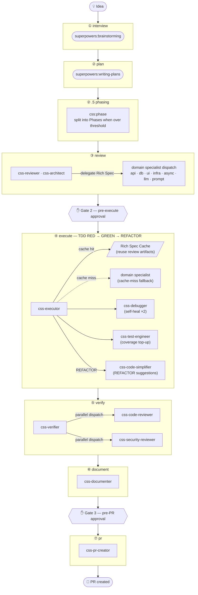

> **English** · [한국어](README.md)

# css-claude

**CSS — Claude Super System**: a personal, global software-development automation pipeline for [Claude Code](https://claude.com/claude-code).

Status: **v0.1.0**. Personal-use pipeline. See [`docs/installation.md`](docs/installation.md) for setup.

---

## Overview

Give it an idea and it runs all the way through: spec → plan → review → TDD implementation → verify → document → PR. Eighteen specialized agents are dispatched stage by stage, with human approval gates at the high-stakes decision points.

```
/css:interview  →  /css:plan  →  /css:phase  →  /css:review  →  /css:execute  →  /css:verify  →  /css:document  →  /css:pr
                                                                                                                        ↑
                                                         /css:ship  ──── runs the whole pipeline with 3 approval gates ─┘
```

### Pipeline + agent topology



### Stage-by-stage detail

| Stage | Command | Agents | Output |
|:---:|--------|----------|--------|
| ① | `/css:interview` | `superpowers:brainstorming` | `docs/superpowers/specs/YYYY-MM-DD-*.md` |
| ② | `/css:plan` | `superpowers:writing-plans` | `docs/superpowers/plans/YYYY-MM-DD-*.md` |
| ②.5 | `/css:phase` | (executor) | `phase-manifest-{slug}.json` + child Phase sessions |
| ③ | `/css:review` | `css-reviewer` (opus) + domain specialists | Rich Spec (per-task RED scaffold + GREEN template) |
| ④ | `/css:execute` | `css-executor` (sonnet) + fallback specialists | `css/{slug}` branch — TDD implementation complete |
| ⑤ | `/css:verify` | `css-verifier` + `css-code-reviewer` + `css-security-reviewer` | verification report (coverage ≥85%) |
| ⑥ | `/css:document` | `css-documenter` (sonnet) | `docs/{slug}/README.md` and more (Phase sessions: `docs/{epic}/p{n}/README.md`) |
| ⑦ | `/css:pr` | `css-pr-creator` (haiku) | GitHub PR (Phase sessions: `--base <base_branch>` stacked PR) |

### Domain-specialist agents (8 of 18)

They author Rich Specs in the review stage and are only called as a fallback on a cache miss during execute (~40–50% cost savings).

| Agent | Specialty | Model |
|----------|-----------|:----:|
| `css-api-specialist` | REST / GraphQL / gRPC / tRPC API design | sonnet |
| `css-db-specialist` | PostgreSQL / Redis / ARQ schema, queries, migrations | sonnet |
| `css-ui-engineer` | Web + Android (Material 3, Jetpack Compose) UI | sonnet |
| `css-infra-engineer` | Docker / Kubernetes / CI-CD / nginx | sonnet |
| `css-async-coder` | Python asyncio concurrency | sonnet |
| `css-langgraph-engineer` | LangChain / LangGraph / LangFuse + vector DB / RAG | sonnet |
| `css-prompt-engineer` | 9-section prompt design and refactoring | opus |
| `css-architect` | architecture advisory (read-only, review-stage advisory) | opus |

### Epic / Phase decomposition

Large ideas are hard to handle in a single execution session. CSS plans an idea as an **Epic** and then decomposes it into **Phases** that can run in parallel or in sequence.

| Layer | Description |
|------|------|
| **Project** | a single software project (`css-claude`, `web-project`, etc.) |
| **Epic** | the full plan covering one feature scope (per slug, a single `_active.json` entry) |
| **Phase** | an independently executable unit carved out of the Epic as a vertical slice — each gets its own worktree + branch + PR |
| **Stage** | a pipeline stage within each Phase (plan/review/execute/verify/document/pr) |

**Threshold (D7):** if `task_count > 20 OR batch_count > 4`, `/css:phase` decomposes the Epic into 2–5 Phases. Below the threshold it proceeds as a single session (existing behavior preserved).

**Branch rules:** `phase_slug = "{epic}-p{n}"`, `phase_branch = "css/{epic}/p{n}"`. A Phase with predecessors creates a stacked PR based on the predecessor Phase's branch.

Detailed design: [`docs/superpowers/specs/2026-05-29-epic-phase-pipeline-design.md`](docs/superpowers/specs/2026-05-29-epic-phase-pipeline-design.md)

---

## Quick start

After installing:

```
/css:ship "<idea>"
```

See [`docs/usage.md`](docs/usage.md) for the full command reference.

## Dashboard (Optional)

Install the dashboard to visualize all in-progress CSS sessions on a Kanban board and handle Gate approvals via drag-and-drop.

```bash
bash scripts/install-dashboard.sh
```

See [`dashboard/README.md`](dashboard/README.md) for details.

## Key features

- **Idea → PR automation**: with explicit human approval gates at the important decision points
- **TDD enforced**: the execute stage requires ≥85% test coverage
- **Cache-first execution**: the review stage's Rich Specs are reused in execute — minimizing repeat specialist calls
- **Automatic language detection**: JS/TS, Python, Go, Rust, Java (Maven), Java/Kotlin (Gradle, including Android Compose)
- **State persistence and resume**: resume from the interruption point via `<project>/.claude/css/sessions/{slug}.json`
- **Concurrent multi-session**: run different features in parallel per terminal in the same project, isolated per slug
- **Automatic loopback cap**: escalates to the user when the limit is exceeded
- **OMC-independent**: depends only on Claude Code's `superpowers` plugin and the `gh` CLI

## Design docs

See [`docs/specs/2026-05-27-css-pipeline-design.md`](docs/specs/2026-05-27-css-pipeline-design.md) for the full design.

## Prerequisites

- Claude Code
- the `superpowers` plugin enabled
- the `gh` CLI authenticated
- `git` ≥ 2.5

## Installation

Install via the platform script:

- Windows: `powershell -ExecutionPolicy Bypass -File scripts\install.ps1`
- Ubuntu 22.04: `bash scripts/install.sh`

See [`docs/installation.md`](docs/installation.md) for details.

## Directory structure

```
css-claude/
├── README.md
├── commands/      # → ~/.claude/commands/css/
├── agents/        # → ~/.claude/agents/css/
├── config/        # default settings
├── scripts/       # install / uninstall scripts (Windows + Ubuntu)
├── docs/          # design docs, usage, troubleshooting
└── tests/         # agent golden tests + toy fixtures
```

## License

Personal use. Redistribution not permitted at this stage.
