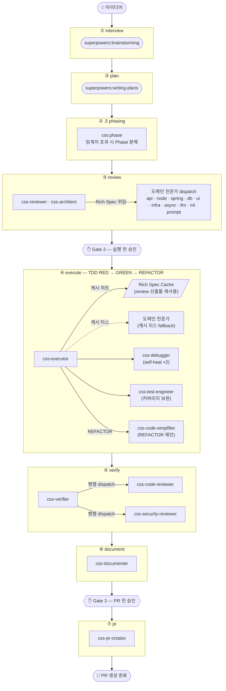

> [English](README.en.md) · **한국어**

# css-claude

**CSS — Claude Super System**: [Claude Code](https://claude.com/claude-code)를 위한 개인용 글로벌 소프트웨어 개발 자동화 파이프라인.

상태: **v0.1.0**. 개인 사용 파이프라인. 설치 방법은 [`docs/installation.ko.md`](docs/installation.ko.md)를 참고하세요.

---

## 개요

아이디어를 입력하면 spec 작성 → 계획 → 검토 → TDD 구현 → 검증 → 문서화 → PR까지 자동으로 진행됩니다. 총 18개의 전문 에이전트가 단계별로 투입되며, 고비용 결정 시점에는 사람의 승인 게이트가 개입합니다.

```
/css:interview  →  /css:plan  →  /css:phase  →  /css:review  →  /css:execute  →  /css:verify  →  /css:document  →  /css:pr
                                                                                                                        ↑
                                                         /css:ship  ──── 3개 승인 게이트로 전체 실행 ────────────────────┘
```

### 파이프라인 + 에이전트 구조



### 단계별 상세

| 단계 | 커맨드 | 에이전트 | 산출물 |
|:---:|--------|----------|--------|
| ① | `/css:interview` | `superpowers:brainstorming` | `docs/superpowers/specs/YYYY-MM-DD-*.md` |
| ② | `/css:plan` | `superpowers:writing-plans` | `docs/superpowers/plans/YYYY-MM-DD-*.md` |
| ②.5 | `/css:phase` | (executor) | `phase-manifest-{slug}.json` + child Phase sessions |
| ③ | `/css:review` | `css-reviewer` (opus) + 도메인 전문가 | Rich Spec (태스크별 RED scaffold + GREEN 템플릿) |
| ④ | `/css:execute` | `css-executor` (sonnet) + fallback 전문가 | `css/{slug}` 브랜치 — TDD 구현 완료 |
| ⑤ | `/css:verify` | `css-verifier` + `css-code-reviewer` + `css-security-reviewer` | 검증 리포트 (커버리지 ≥85%) |
| ⑥ | `/css:document` | `css-documenter` (sonnet) | `docs/{slug}/README.md` 외 (Phase 세션: `docs/{epic}/p{n}/README.md`) |
| ⑦ | `/css:pr` | `css-pr-creator` (haiku) | GitHub PR (Phase 세션: `--base <base_branch>` 스택 PR) |

### 도메인 전문가 에이전트 (21개 중 11개)

review 단계에서 Rich Spec을 생성하고, execute 단계에서는 캐시 미스 시에만 fallback으로 호출됩니다 (비용 절감 ~40–50%).

| 에이전트 | 전문 영역 | 모델 |
|----------|-----------|:----:|
| `css-api-specialist` | Python / FastAPI REST·GraphQL API 설계 | sonnet |
| `css-node-backend` | Node.js / NestJS (3-layer + DI) 백엔드 | sonnet |
| `css-spring-backend` | Java·Kotlin / Spring Boot (3-layer + DI) 백엔드 | sonnet |
| `css-db-specialist` | PostgreSQL / Redis / ARQ + MongoDB + JPA·QueryDSL + TypeORM·Mongoose (polyglot 데이터) | sonnet |
| `css-ui-engineer` | Web (React/Vue/Svelte/Angular + Next.js) + Android (Compose) UI | sonnet |
| `css-infra-engineer` | Docker / Kubernetes / CI-CD / nginx + Terraform | sonnet |
| `css-async-coder` | Python asyncio 동시성 | sonnet |
| `css-langgraph-engineer` | LangChain / LangGraph / LangFuse + 벡터 DB / RAG | sonnet |
| `css-ml-engineer` | scikit-learn / PyTorch 피처·추론·평가 (테스트 가능 코드) | sonnet |
| `css-prompt-engineer` | 9-섹션 프롬프트 설계 및 리팩토링 | opus |
| `css-architect` | 아키텍처 자문 (read-only, review 단계 advisory) | opus |

### Epic / Phase 분해

대규모 아이디어는 단일 실행 세션으로 처리하기 어렵습니다. CSS는 아이디어를 **Epic**으로 계획한 후 병렬·순차 실행 가능한 **Phase**로 분해합니다.

| 계층 | 설명 |
|------|------|
| **Project** | 하나의 소프트웨어 프로젝트 (`css-claude`, `web-project` 등) |
| **Epic** | 하나의 기능 범위를 다루는 전체 계획 (slug 단위, 단일 `_active.json` 항목) |
| **Phase** | Epic을 수직 슬라이스로 분해한 독립 실행 단위 — 각자의 worktree + 브랜치 + PR 생성 |
| **Stage** | 각 Phase 내 파이프라인 단계 (plan/review/execute/verify/document/pr) |

**임계치 (D7):** `task_count > 20 OR batch_count > 4` 이면 `/css:phase`가 Epic을 2–5개 Phase로 분해합니다. 임계치 미만이면 단일 세션으로 진행 (기존 동작 유지).

**브랜치 규칙:** `phase_slug = "{epic}-p{n}"`, `phase_branch = "css/{epic}/p{n}"`. 선행 Phase가 있는 Phase는 선행 Phase 브랜치를 base로 스택 PR을 생성합니다.

상세 설계: [`docs/superpowers/specs/2026-05-29-epic-phase-pipeline-design.ko.md`](docs/superpowers/specs/2026-05-29-epic-phase-pipeline-design.ko.md)

---

## 빠른 시작

설치 후:

```
/css:ship "<아이디어>"
```

전체 커맨드 레퍼런스는 [`docs/usage.ko.md`](docs/usage.ko.md)를 참고하세요.

## Dashboard (Optional)

대시보드를 설치하면 진행 중인 모든 CSS 세션을 Kanban 보드에서 시각화하고 Gate 승인을 드래그&드롭으로 처리할 수 있습니다.

```bash
bash scripts/install-dashboard.sh
```

자세한 내용은 [`dashboard/README.ko.md`](dashboard/README.ko.md)를 참고하세요.

## 주요 기능

- **아이디어 → PR 자동화**: 중요한 결정 시점에 명시적인 사람의 승인 게이트 포함
- **TDD 강제 적용**: execute 단계에서 테스트 커버리지 ≥85% 요구
- **캐시 우선 실행**: review 단계의 Rich Spec을 execute에서 재사용 — 전문가 재호출 최소화
- **자동 언어 감지**: JS/TS, Python, Go, Rust, Java (Maven), Java/Kotlin (Gradle, Android Compose 포함)
- **상태 저장 및 재개**: `<project>/.claude/css/sessions/{slug}.json`으로 중단 시점부터 재개 가능
- **멀티 세션 동시 실행**: 같은 프로젝트에서 터미널별로 다른 기능을 병렬 진행, 슬러그 단위 격리
- **자동 루프백 횟수 제한**: 한도 초과 시 사용자에게 에스컬레이션
- **OMC 독립**: Claude Code의 `superpowers` 플러그인과 `gh` CLI만 의존

## 설계 문서

전체 설계는 [`docs/specs/2026-05-27-css-pipeline-design.ko.md`](docs/specs/2026-05-27-css-pipeline-design.ko.md)를 참고하세요.

## 사전 조건

- Claude Code
- `superpowers` 플러그인 활성화
- `gh` CLI 인증 완료
- `git` ≥ 2.5

## 설치

플랫폼 스크립트로 설치:

- Windows: `powershell -ExecutionPolicy Bypass -File scripts\install.ps1`
- Ubuntu 22.04: `bash scripts/install.sh`

자세한 내용은 [`docs/installation.ko.md`](docs/installation.ko.md)를 참고하세요.

## 디렉토리 구조

```
css-claude/
├── README.md
├── commands/      # → ~/.claude/commands/css/
├── agents/        # → ~/.claude/agents/css/
├── config/        # 기본 설정
├── scripts/       # 설치 / 제거 스크립트 (Windows + Ubuntu)
├── docs/          # 설계 문서, 사용법, 트러블슈팅
└── tests/         # 에이전트 골든 테스트 + 토이 픽스처
```

## 라이선스

개인 사용 목적. 현 단계에서는 재배포 불가.
