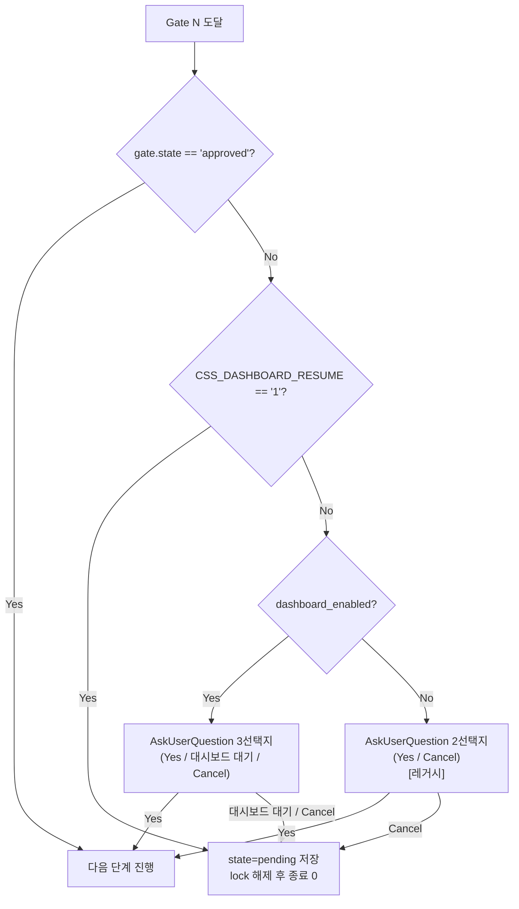

# Pipeline Dashboard — 아키텍처

## 전체 구성

```
┌────────────────────────────── Ubuntu 22.04 호스트 ──────────────────────────────┐
│                                                                                  │
│  ┌──────────────────┐                                                            │
│  │ Claude Code (TUI) │  /css:ship --session X 실행                               │
│  │                   │  쓰기: <project>/.claude/css/sessions/X.json              │
│  │                   │  쓰기: ~/.claude/css-dashboard/projects.json (자동 등록)  │
│  └──────────────────┘                                                            │
│           ▲                                                                      │
│           │ claude --print '/css:ship --session X' (CSS_DASHBOARD_RESUME=1)     │
│           │                                                                      │
│  ┌────────┴────────────────────────── docker-compose ──────────────────────────┐ │
│  │                                                                             │ │
│  │  ┌─────────────────────────┐    ┌─────────────────────────┐                │ │
│  │  │ dashboard (FastAPI)     │    │ PostgreSQL 16            │                │ │
│  │  │  - watchdog 파일 감시   │◄──►│  - projects              │                │ │
│  │  │  - REST + SSE           │    │  - sessions_history       │                │ │
│  │  │  - React 정적 빌드 서브 │    │  - gate_audit_log         │                │ │
│  │  └─────┬───────────────────┘    │  - daemon_runs            │                │ │
│  │        │                        └─────────────────────────┘                │ │
│  └────────┼────────────────────────────────────────────────────────────────────┘ │
│           │ 승인 이벤트를 queue dir에 기록                                       │
│  ┌────────▼─────────┐  ← 호스트의 systemd 유저 서비스로 실행                    │
│  │ daemon-bridge    │  ~/.claude/css-dashboard/queue/*.json 감시                │
│  │ (~80 LoC Python) │  이벤트 수신 시: claude --print '/css:ship --session X'  │
│  │                  │  실행 결과를 dashboard에 POST 콜백                        │
│  └──────────────────┘                                                            │
│                                                                                  │
│  ~/.claude/                                                                      │
│   ├── css/sessions/<session-id>.json   ← 상태 원본                               │
│   ├── css-dashboard/                                                             │
│   │     ├── config.json    ← {dashboard_enabled, claude_cli, ...}               │
│   │     ├── projects.json  ← 자동 등록된 프로젝트 목록                          │
│   │     ├── queue/<evt-id>.json  ← 승인 신호 파일 (브리지가 소비)               │
│   │     ├── queue/processed/, queue/failed/                                     │
│   │     └── runs/<run-id>.log                                                   │
└──────────────────────────────────────────────────────────────────────────────────┘
                               ▲
                               │ http://<host-ip>:7421 (LAN, 인증 없음)
                               │ React 드래그 → POST /api/...
                               │ 서버 → React via /api/sse (SSE)
                             ┌─┴────────┐
                             │ Browser  │
                             │ (Windows)│
                             └──────────┘
```

---

## 컴포넌트별 역할

### FastAPI 백엔드 (`dashboard/backend/`)

| 파일 | 역할 |
|------|------|
| `main.py` | FastAPI app, lifespan(watcher 시작), CORS 미들웨어 |
| `config.py` | Pydantic Settings — 환경 변수에서 설정 로딩 |
| `db.py` | 비동기 SQLAlchemy 엔진 싱글턴, 세션 팩토리 |
| `models.py` | ORM 모델 (Project, SessionHistory, GateAuditLog, DaemonRun) |
| `watcher.py` | watchdog `Observer` — 세션 JSON 변경 감지 → SSE 브로드캐스트, 완료 시 아카이브 |
| `sse.py` | SSE 이벤트 브로드캐스터 (asyncio Queue 기반) |
| `deps.py` | FastAPI `Depends` 헬퍼 (DB 세션 주입 등) |
| `routers/sessions.py` | `GET /api/sessions`, `GET /api/sessions/{id}` |
| `routers/gates.py` | `POST /api/sessions/{id}/gates/{gate}/approve`, `/retry` |
| `routers/artifacts.py` | `GET /api/sessions/{id}/artifacts`, `/{name}` |
| `routers/projects.py` | `GET /api/projects`, `PATCH /api/projects/{id}` |
| `routers/history.py` | `GET /api/history` (페이지네이션 + 필터) |
| `routers/internal.py` | `POST /api/internal/run-result` (브리지 콜백) |
| `services/session_reader.py` | 세션 JSON 파싱 (손상 내성) |
| `services/project_registry.py` | `projects.json` 읽기 |
| `services/queue_writer.py` | 승인 큐 파일 원자적 쓰기 |
| `services/archive.py` | 완료 세션 → `sessions_history` INSERT |
| `services/artifact_reader.py` | 아티팩트 마크다운 읽기 (경로 순회 방어) |

### 호스트 브리지 (`dashboard/bridge/bridge.py`)

호스트에서 systemd 유저 서비스로 실행됩니다. 컨테이너 안에서 실행하지 않는 이유는 세 가지입니다.

1. `claude` OAuth 인증 정보(`~/.claude/.credentials`)를 컨테이너에 마운트하지 않아도 됩니다.
2. `git worktree add ../<repo>-css-<session>` 해석을 위해 프로젝트 상위 디렉터리를 전체 볼륨으로 마운트하지 않아도 됩니다.
3. DNS/프록시 설정이 호스트와 동일하게 유지됩니다.

동작 흐름:

```
queue/*.json 감지 (watchdog)
  → requests.post(callback_url, {event: "started"})
  → subprocess.run(["claude", "--print", "/css:ship --session X"],
                   cwd=project_root,
                   env={..., "CSS_DASHBOARD_RESUME": "1"},
                   timeout=3600)
  → requests.post(callback_url, {event: "finished", exit_code: ...})
  → 파일을 queue/processed/ 또는 queue/failed/로 이동
```

시작 시 queue 디렉터리의 미처리 파일을 재처리하므로 재시작 안전(idempotent)합니다.

### React 프론트엔드 (`dashboard/frontend/src/`)

```
App
 ├─ TopBar          — 타이틀, 레포 필터 칩, 히스토리 링크, 설정 버튼
 ├─ KanbanBoard     — 7컬럼 DnD 컨텍스트 (dnd-kit)
 │   └─ Column × 7
 │       └─ SessionCard × n
 ├─ DetailSlideOver — 우측 슬라이드 패널 (타임라인 + 아티팩트 아코디언)
 ├─ SettingsModal   — 레포별 색상 피커
 ├─ HistoryView     — /history 라우트
 ├─ ToastContainer  — 토스트 알림
 └─ SSEConnection   — 헤드리스, Zustand 스토어 업데이트
```

상태 관리는 Zustand 스토어 세 개로 분리됩니다.

- `sessionsStore` — 활성 세션 맵
- `projectsStore` — 레포 목록 + 색상
- `uiStore` — 선택된 세션 ID, 모달 열림 상태

---

## CSS 파이프라인 연동

### `CSS_DASHBOARD_RESUME` 환경 변수

브리지는 `claude --print` 호출 시 `CSS_DASHBOARD_RESUME=1` 환경 변수를 설정합니다. `/css:ship` 커맨드는 이 값을 확인하여 비대화형 재실행임을 인식하고 `AskUserQuestion`을 건너뜁니다.

```
is_resume = ($CSS_DASHBOARD_RESUME == "1")

if state == "approved":
    proceed
elif is_resume:
    # 이미 승인된 경우가 아니면 state를 pending으로 기록하고 종료
    save_session(); exit 0
else:
    AskUserQuestion(...)  # 대화형 터미널 흐름
```

### 교차 승인 Gate 로직 (Cross-path Gate)

Gate 2와 Gate 3 각각에서 아래 세 경로 중 하나로 처리됩니다.



### 잠금 파일 기반 상호 배제

`<project>/.claude/css/locks/<id>.lock` 파일이 존재하면 CSS 파이프라인이 해당 단계를 실행 중인 것입니다. 대시보드의 Gate 승인 엔드포인트는 이 파일을 확인하여 잠금이 있으면 409 Conflict를 반환합니다.

---

## 데이터 흐름 — Gate 승인 End-to-End

```
브라우저 드래그 (review → execute)
  │
  ▼
POST /api/sessions/{id}/gates/gate2_pre_execute/approve
  ① lock 파일 확인 → 있으면 409
  ② sessions/<id>.json 원자적 업데이트 (state="approved", source="dashboard_drag")
  ③ queue/<evt-id>.json 쓰기
  ④ gate_audit_log INSERT
  ⑤ SSE 브로드캐스트: gate_approved
  │
  ▼
[bridge] queue 파일 감지
  → claude --print '/css:ship --session X' (CSS_DASHBOARD_RESUME=1)
  → POST /api/internal/run-result {event: "started"}
  │
  ▼
[FastAPI] SSE 브로드캐스트: resume_started
  │
  ▼
[claude] 비대화형 실행 — gate 상태 approved 확인 → execute → verify → document → Gate 3...
  세션 JSON 갱신 중
  │
  ▼
[watcher] JSON 변경 감지 → SSE session_updated (복수)
  │
  ▼
[bridge] claude --print 종료 → POST run-result {event: "finished"}
  파일 → queue/processed/ 이동
  │
  ▼
[FastAPI] daemon_runs 갱신. 파이프라인 완료 시 sessions_history INSERT
```

실패 경로: 브리지가 `event: "failed"`를 POST → `gate_audit_log.resume_status = "failed"` → SSE `resume_failed` → UI 빨간 표시기 + Retry 버튼.

---

## 데이터베이스 스키마

```sql
-- 등록된 프로젝트 (레포별 색상 포함)
CREATE TABLE projects (
  id            SERIAL PRIMARY KEY,
  repo_root     TEXT UNIQUE NOT NULL,
  repo_name     TEXT NOT NULL,
  color         TEXT NOT NULL DEFAULT '#3b82f6',
  registered_at TIMESTAMPTZ NOT NULL DEFAULT now(),
  last_seen_at  TIMESTAMPTZ NOT NULL DEFAULT now()
);

-- 완료된 세션 아카이브
CREATE TABLE sessions_history (
  id              SERIAL PRIMARY KEY,
  project_id      INT REFERENCES projects(id) ON DELETE CASCADE,
  session_id      TEXT NOT NULL,
  idea            TEXT NOT NULL,
  started_at      TIMESTAMPTZ NOT NULL,
  finished_at     TIMESTAMPTZ,
  final_phase     TEXT NOT NULL,
  outcome         TEXT NOT NULL CHECK (outcome IN ('completed','failed','aborted')),
  pr_url          TEXT,
  phase_durations JSONB NOT NULL,
  snapshot        JSONB NOT NULL,
  archived_at     TIMESTAMPTZ NOT NULL DEFAULT now()
);

-- Gate 승인 감사 로그
CREATE TABLE gate_audit_log (
  id              SERIAL PRIMARY KEY,
  project_id      INT REFERENCES projects(id),
  session_id      TEXT NOT NULL,
  gate            TEXT NOT NULL CHECK (gate IN ('gate2_pre_execute','gate3_pre_pr')),
  reached_at      TIMESTAMPTZ NOT NULL,
  approved_at     TIMESTAMPTZ,
  approval_source TEXT CHECK (approval_source IN ('dashboard_drag','terminal_ask')),
  resume_status   TEXT CHECK (resume_status IN ('success','failed','retrying')),
  retry_count     INT NOT NULL DEFAULT 0,
  error_message   TEXT
);

-- 브리지 실행 로그
CREATE TABLE daemon_runs (
  id           SERIAL PRIMARY KEY,
  session_id   TEXT NOT NULL,
  command      TEXT NOT NULL,
  started_at   TIMESTAMPTZ NOT NULL,
  finished_at  TIMESTAMPTZ,
  exit_code    INT,
  stdout_tail  TEXT,
  stderr_tail  TEXT
);
```

Alembic 초기 마이그레이션: `dashboard/alembic/versions/0001_initial.py`

---

## SSE 이벤트 목록

| 이벤트 | 데이터 | 발생 시점 |
|--------|--------|----------|
| `session_updated` | `{session_id, phase, gates, mtime}` | 세션 JSON 변경 감지 시 |
| `gate_reached` | `{session_id, gate, reached_at}` | Gate 대기 상태 진입 시 |
| `gate_approved` | `{session_id, gate, source}` | Gate 승인 직후 |
| `resume_started` | `{session_id, run_id, command}` | 브리지가 claude 실행 시작 시 |
| `resume_failed` | `{session_id, gate, error, retry_count}` | 실행 실패 시 |
| `session_completed` | `{session_id, pr_url, outcome, durations}` | 파이프라인 완료 시 |
| `project_registered` | `{project_id, repo_name, color}` | 신규 프로젝트 등록 시 |
| `connection_health` | `{db, watcher, bridge}` | 30초마다 헬스체크 |

SSE 재연결: 1s/2s/4s/8s 지수 백오프. LAN 단절 시 TopBar에 "재연결 중..." 배너 표시.

---

## 파일 시스템 레이아웃

| 데이터 | 위치 | 소유자 |
|--------|------|--------|
| 활성 세션 상태 | `<project>/.claude/css/sessions/<id>.json` | CSS 커맨드 쓰기, 감시자 읽기 |
| 단계 잠금 | `<project>/.claude/css/locks/<id>.lock` | CSS 커맨드, 브리지 확인 |
| 등록된 프로젝트 | `~/.claude/css-dashboard/projects.json` | CSS interview 커맨드 자동 추가 |
| 승인 큐 | `~/.claude/css-dashboard/queue/*.json` | 대시보드 쓰기, 브리지 소비 |
| 실행 로그 | `~/.claude/css-dashboard/runs/<run-id>.log` | 브리지 쓰기, 대시보드 조회 |
| 대시보드 설정 | `~/.claude/css-dashboard/config.json` | 설치 스크립트 쓰기 |
| 완료 세션 아카이브 | PostgreSQL `sessions_history` | 감시자 INSERT |
| 레포 색상 등 설정 | PostgreSQL `projects` | 대시보드 UI → REST |
