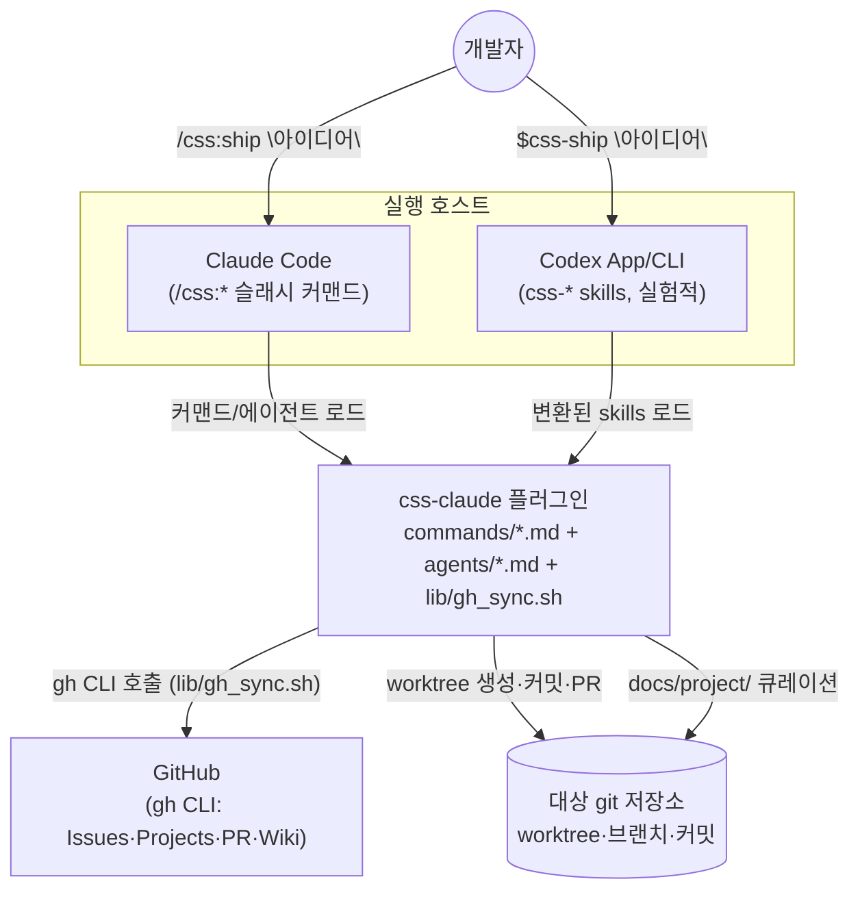
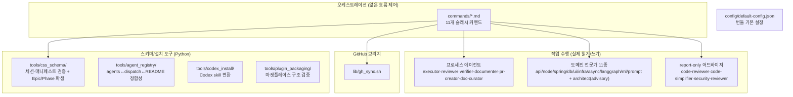
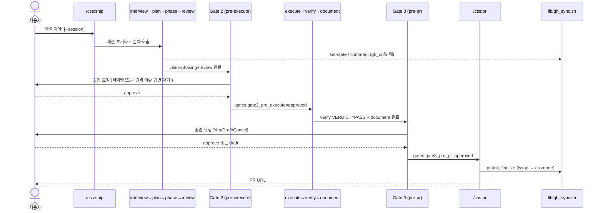
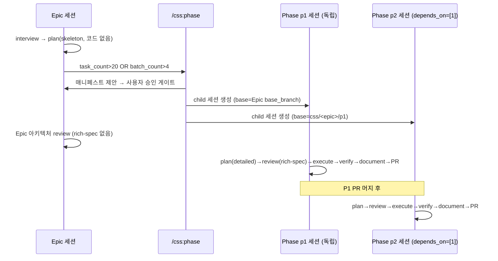
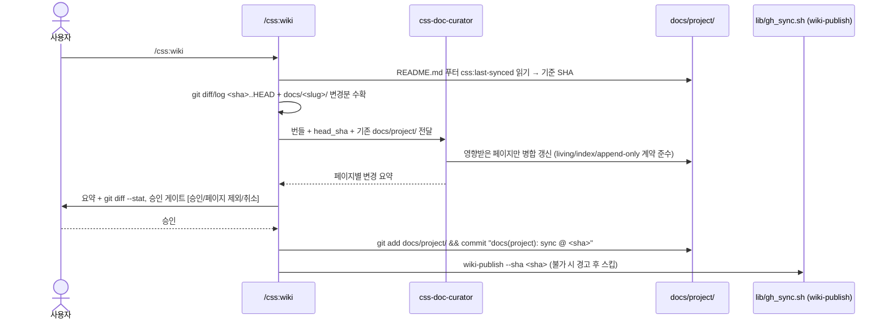

<!-- css:updated: 079b623 2026-07-04 -->

# 아키텍처

> 이 저장소 자체가 "css-claude"라는 **Claude Code 플러그인**입니다 (`.claude-plugin/plugin.json:3` — 이름 `css`, 버전 `0.2.0`). 최종 사용자용 서비스가 아니라, 다른 git 저장소에서 실행되는 CSS 파이프라인(아이디어 → PR)을 구현하는 커맨드/에이전트/스크립트 모음입니다. 따라서 아래 "시스템"은 이 플러그인 자체를 가리키며, 전통적인 서버/DB 아키텍처가 아닙니다.

## 1. 시스템 컨텍스트

세션 상태(`<project>/.claude/css/`)는 Claude Code와 Codex 양쪽에서 공유되므로 한쪽에서 시작한 세션을 다른 쪽에서 재개할 수 있습니다 (`docs/installation.md:97`).

## 2. 모듈 구성

| 모듈 | 책임 | 코드 위치 |
|---|---|---|
| `commands/` | 11개 파이프라인 오케스트레이터. 실제 작업 없이 세션 상태를 읽고 에이전트를 dispatch만 함 | `commands/*.md` |
| `agents/` | 22개 전문 에이전트 — 프로세스 에이전트(executor/reviewer/verifier/documenter/pr-creator/doc-curator) + 도메인 전문가 11종 + report-only 어드바이저 | `agents/*.md` |
| `lib/gh_sync.sh` | GitHub Issues/Projects/PR/Wiki 브리지. 상주 서버 없이 `gh` CLI만 래핑 | `lib/gh_sync.sh:1-4` |
| `tools/css_schema/` | 세션 JSON·`phase_manifest`·`_active.json` 스키마 검증(`schema.py`) + Epic/Phase 파생 로직(임계치·슬러그·브랜치, `derive.py`) | `tools/css_schema/schema.py`, `tools/css_schema/derive.py` |
| `tools/agent_registry/` | agents frontmatter ↔ `executor.md`의 `Domain_Dispatch_Table` ↔ README 전문가 표 사이의 정합성을 강제하는 회귀 가드 | `tools/agent_registry/registry.py:1-9` |
| `tools/codex_install/` | Claude Code `commands/agents`를 Codex skills로 변환·설치 (`model:` frontmatter 제거, i18n 파일 제외) | `tools/codex_install/installer.py:1-27`, `tools/codex_install/transform.py` |
| `tools/plugin_packaging/` | 마켓플레이스 플러그인 구조(스텀 이름, i18n 분리, README 설치 안내) 검증 | `tools/plugin_packaging/test_structure.py:6-27` |
| `config/` | 번들 기본 설정(`session.config`의 하위 계층) | `config/default-config.json` |
| `scripts/` | Windows/Ubuntu/Codex 설치·제거 스크립트 | `scripts/install.sh`, `scripts/install.ps1`, `scripts/install-codex.{sh,ps1}`, `scripts/uninstall.{sh,ps1}` |
| `i18n/` | `commands/`·`agents/`의 한국어 참조 번역 (플러그인 auto-discovery와 충돌 방지 목적으로 분리 — ADR-0006) | `i18n/commands/*.ko.md`, `i18n/agents/*.ko.md` |
| `docs/` | 설계 스펙·플랜 아카이브(`specs/`, `superpowers/`), 완료 기능 스냅샷(`docs/<slug>/`), 그리고 이 living docs(`docs/project/`) | `docs/specs/`, `docs/superpowers/`, `docs/<slug>/` |

## 3. 주요 흐름

### 3.1 `/css:ship` 마스터 플로우 (단일 세션, 3-게이트)

(출처: `commands/ship.md:6-170`)

### 3.2 Epic → Phase 분해 (대형 아이디어)

(출처: `commands/phase.md:8-27`, `docs/epic-phase-pipeline/README.md:142-179`)

### 3.3 `/css:wiki` 증분 동기화

(출처: `commands/wiki.md:16-56`)

## 4. 기술 스택

| 계층 | 기술 | 버전 | 선정 근거 |
|---|---|---|---|
| 실행 호스트(주) | Claude Code 플러그인 | plugin manifest `0.2.0` (`.claude-plugin/plugin.json:5`) | 마켓플레이스 배포 — [ADR-0006](decisions/ADR-0006-plugin-marketplace-distribution.md) |
| 실행 호스트(대체) | OpenAI Codex App/CLI | 실험적 (`docs/installation.md:70-97`) | 동일 파이프라인 이중 실행 — [ADR-0004](decisions/ADR-0004-codex-compatibility.md) |
| 오케스트레이션 | Bash (`set -euo pipefail`) | — | 상주 서버 없는 `gh` CLI 브리지 — [ADR-0005](decisions/ADR-0005-github-issues-projects-tracking.md) |
| 스키마/도구 | Python 3 (`unittest`) | 버전 미고정 — 미확인 | 세션 스키마 검증·Codex 변환·정합성 가드 |
| GitHub 연동 | `gh` CLI + `jq` | 버전 고정 없음 — 미확인 | Issues/Projects/PR/Wiki 전부 `gh` 하나로 처리 — [ADR-0005](decisions/ADR-0005-github-issues-projects-tracking.md) |
| 문서 | Markdown + Mermaid | — | 사람이 읽는 living docs — [ADR-0007](decisions/ADR-0007-project-docs-curation.md) |
| 브레인스토밍/계획 | `superpowers` 플러그인 (`superpowers:brainstorming`, `superpowers:writing-plans`) | 외부 의존 (`commands/interview.md:29`) | interview/plan 단계의 실제 대화 엔진 |

## 5. 모듈 경계·의존 규칙

- **커맨드는 오케스트레이터, 에이전트는 워커.** `commands/*.md`는 세션 JSON을 읽고/쓰고 에이전트를 dispatch할 뿐 스스로 코드를 작성하지 않는다 (원 설계 결정, `docs/specs/2026-05-27-css-pipeline-design.md:50`).
- **Report-only 어드바이저는 쓰기 금지가 frontmatter로 강제된다.** `css-architect`, `css-code-reviewer`, `css-code-simplifier`, `css-security-reviewer`는 `disallowedTools: [Write, Edit]`를 선언한다 (예: `agents/architect.md:6`, `agents/code-reviewer.md:6`).
- **도메인 전문가는 review에서 생성, execute에서는 캐시 미스 fallback.** `agents/executor.md:39-41`의 `Rich_Spec_Contract` — 정확한 `rich_specs` 경로만 소비하고, 레거시 세션에서만 언어 프로파일 커맨드로 대체한다.
- **데이터 계층은 `css-db-specialist` 단일 권위로 위임된다.** Python(SQLAlchemy/Beanie), Java(JPA/QueryDSL/Flyway), Node(TypeORM/Mongoose) 세 백엔드 모두 엔티티/마이그레이션을 직접 소유하지 않는다 (`agents/db-specialist.md:11-12`, `docs/domain-expert-expansion/README.md:25-35`) — [ADR-0003](decisions/ADR-0003-domain-expert-expansion.md).
- **GitHub 접근은 `lib/gh_sync.sh`로만 중계된다.** 다른 커맨드는 직접 `gh`를 호출하지 않고 `GHS() { bash .../gh_sync.sh "$@"; }` 헬퍼를 통해서만 접근한다 (`commands/ship.md:21`, `commands/wiki.md:28-31`).
- **executor는 worktree 바깥 쓰기를 거부한다.** `/css:execute`는 `pwd`가 worktree와 일치하는지 확인 후에만 쓰기를 허용하고, 불일치 시 ESCALATE한다 (`commands/execute.md:23`).
- **`css_stages` 프론트매터가 파이프라인 단계 소속을 선언한다.** 도메인 전문가 판별은 구조적으로 `css_stages`에 `review`와 `execute`가 모두 있는지로 결정되며, `tools/agent_registry/registry.py:6-9`가 이를 회귀 테스트로 강제한다.

## 6. 횡단 관심사

- **락 규약**: `<project>/.claude/css/locks/{slug}-{stage}.lock`에 `{acquired_at}` 저장, 60분 경과 시 stale로 간주해 교체, 모든 종료 경로(루프백·취소 포함)에서 해제 (`docs/session-schema.md:83-88`).
- **언어 정책**: 에이전트 시스템 프롬프트/정책 텍스트는 영어, 사용자 대면 산출물(체크포인트·로그·문서)은 한국어 (`docs/specs/2026-05-27-css-pipeline-design.md:51`, `agents/executor.md:59`).
- **커밋 트레일러**: `CSS-Slug`/`CSS-Task` 등 CSS-* 트레일러만 사용하고 Claude/AI 저작자 표시(`Co-Authored-By: Claude`, `🤖 Generated with...`)는 금지 (`agents/executor.md:52`, `commands/pr.md:61`).
- **보안 가드레일**: force-push, `git reset --hard`, 추적 경로 `rm -rf`, `chmod 777` 금지 — executor 디스패치 시 명시적으로 지시됨 (`commands/execute.md:23`).
- **Graceful degradation**: `gh` 미인증/미설치, GitHub Wiki 비활성(private+Free 요금제, 미초기화 wiki)일 때 관련 기능만 경고 로그 후 스킵하고 나머지는 그대로 동작 (`lib/gh_sync.sh:60-66` `gh_enabled`, `lib/gh_sync.sh:413-437` `cmd_wiki_publish`).
- **멀티세션 격리**: 슬러그별로 독립된 세션 파일·worktree·브랜치를 가지며 `_active.json`은 last-writer-wins 편의 포인터일 뿐 동시 실행 조율에 쓰이지 않는다 (`docs/session-schema.md:76-81`).
