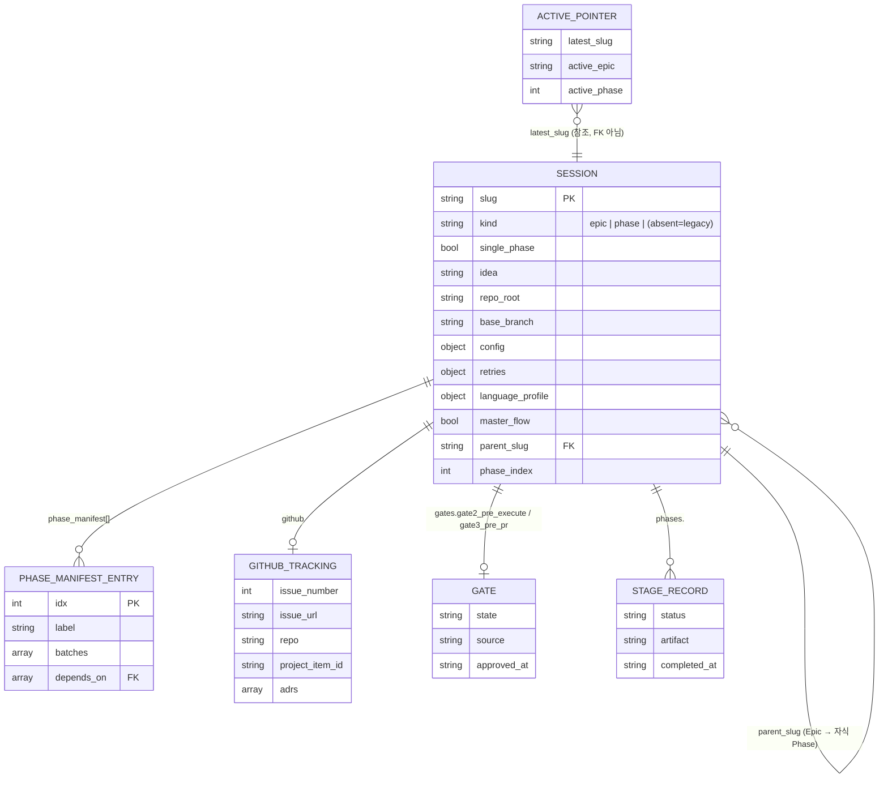

<!-- css:updated: 079b623 2026-07-04 -->

# 데이터 스키마

## 저장소 요약

이 저장소에는 전통적인 DB/API 서비스가 없습니다 — SQL이나 마이그레이션 파일이 존재하지 않습니다(전체 트리 확인 결과 `*.sql`, `migrations/`, ORM 엔티티 없음). 대신 CSS 파이프라인은 **파일 기반 JSON 상태**를 "데이터 계층"으로 사용합니다: `<project>/.claude/css/` 아래의 세션 JSON, phase 매니페스트, `_active.json`이 그것입니다. 이 문서는 그 JSON 스키마를 데이터베이스 스키마에 준하는 형태로 기록합니다. 정식 검증 로직은 `tools/css_schema/schema.py`, 사람이 읽는 필드 레퍼런스는 `docs/session-schema.md`입니다.

`data/migrations.md`는 만들지 않습니다 — 이 저장소에는 스키마 마이그레이션이라는 개념 자체가 없습니다(근거 없음 → 페이지 생략).

## ERD

(근거: `tools/css_schema/schema.py:40-97`, `docs/session-schema.md:11-25, 26-62`)

## 테이블 상세

### 2.1 SESSION

**용도**: 하나의 파이프라인 세션(Epic, 자식 Phase, 또는 `kind` 없는 레거시 단일 세션)의 전체 상태. 소유 기능: [pipeline-orchestration](../features/pipeline-orchestration.md), [epic-phase-decomposition](../features/epic-phase-decomposition.md).

| 필드 | 타입 | 작성자 | 비고 |
|---|---|---|---|
| `slug` | string | interview/ship | kebab-case 세션 id (필수, 비어있으면 안됨) |
| `kind` | `"epic"｜"phase"` | interview/ship/phase | 부재=레거시 단일 세션 |
| `single_phase` | bool | phase | true면 임계치 미만 Epic이 상세 선형 플로우로 실행 |
| `idea` | string | interview/ship | 원본 아이디어 텍스트 |
| `repo_root`, `repo_name` | string | interview | 부재 시 캡처 |
| `base_branch` | string | interview(Epic/단일) / phase(자식) | worktree 분기점 + PR 베이스 기본값 |
| `config` | object | interview | 유저 설정을 번들 기본값 위에 병합 |
| `retries` | object | interview 초기화; review/verify 증가 | `{review, verify}` 루프백 카운터 |
| `language_profile` | object | execute | `{language, test_command, coverage_command}` |
| `master_flow` | bool | ship | true면 하위 스테이지가 자체 게이트 질문을 생략 |
| `gates.gate2_pre_execute`, `gates.gate3_pre_pr` | object | ship | `{state, source, reached_at, approved_at, approved_by}` |
| `github` | object | lib/gh_sync.sh | `{issue_number, issue_url, repo, project_item_id, adrs[], gate2, gate3}` |
| `parent_slug`, `parent_session`, `phase_index`, `phase_label`, `depends_on` | — | phase | 자식 Phase 신원 |
| `child_slugs`, `phase_manifest` | — | phase | Epic 측 팬아웃 기록 |
| `phases.<stage>` | object | 각 스테이지 커맨드 | 최소 `{status, artifact, completed_at}` + 스테이지별 확장 필드 |

인덱스: N/A(파일 기반 JSON, DB 인덱스 없음). 정의 위치: `tools/css_schema/schema.py:66-98`(검증), `docs/session-schema.md:26-62`(필드 레퍼런스).

### 2.2 PHASE_MANIFEST_ENTRY

**용도**: Epic을 Phase로 분해할 때의 각 Phase 정의. 소유 기능: [epic-phase-decomposition](../features/epic-phase-decomposition.md).

| 컬럼 | 제약 |
|---|---|
| `idx` | int ≥ 1, 고유, 이전 항목보다 엄격히 증가 |
| `label` | 비어있지 않은 string |
| `batches` | 비어있지 않은 배열 |
| `depends_on` | 배열, 각 원소는 이미 등장한 더 작은 `idx`만 참조(비순환 보장) |

정의 위치: `tools/css_schema/schema.py:9-38` (`validate_manifest`). 픽스처: `tools/css_schema/fixtures/valid_manifest.json`.

### 2.3 ACTIVE_POINTER (`_active.json`)

**용도**: 가장 최근 세션을 가리키는 last-writer-wins 편의 포인터. FK가 아니라 참조일 뿐이며 동시 실행 조율에는 쓰이지 않는다.

| 필드 | 제약 |
|---|---|
| `latest_slug` | 비어있지 않은 string (필수) |
| `active_epic` | 있으면 비어있지 않은 string |
| `active_phase` | int 또는 null |

정의 위치: `tools/css_schema/schema.py:100-108` (`validate_active`).

## 저장소별 특기사항

- **TTL/무효화**: 없음. 세션 JSON은 명시적으로 `/css:clean`이 삭제하기 전까지 영구 보존된다 (`commands/clean.md`).
- **락 파일**: `locks/{slug}-{stage}.lock`은 별도 스키마 없이 `{acquired_at}` 하나만 가지며 60분 경과 시 stale로 자동 교체된다 — 이것도 "데이터"로 분류되지만 세션과 달리 휘발성이다 (`docs/session-schema.md:83-88`).
- **동시성**: 파일 기반이므로 트랜잭션이 없다. `sess_set()`은 `jq`로 임시 파일에 쓰고 `mv`로 원자적 치환한다 (`lib/gh_sync.sh:55-58`).
